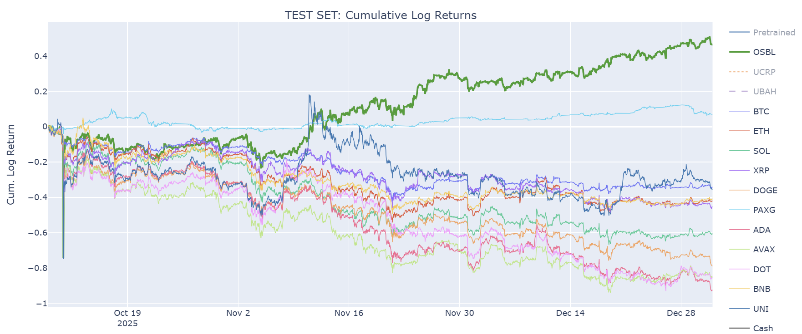
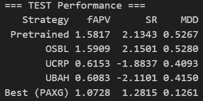
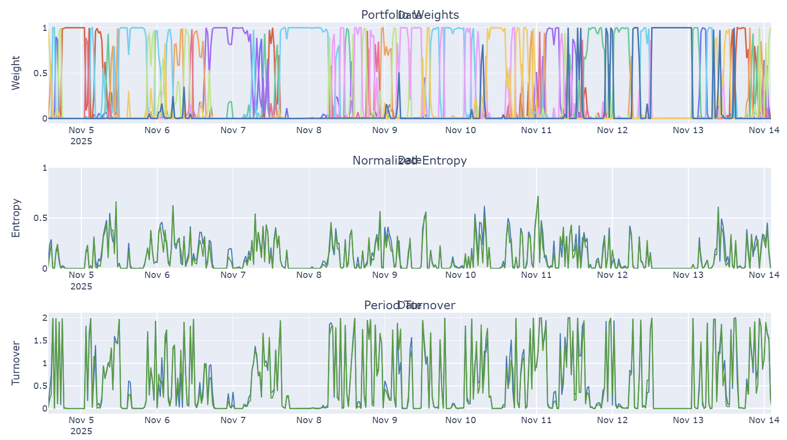
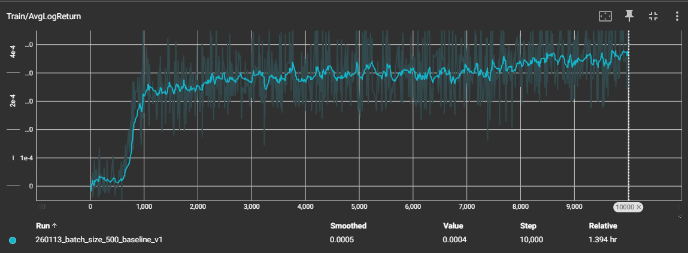
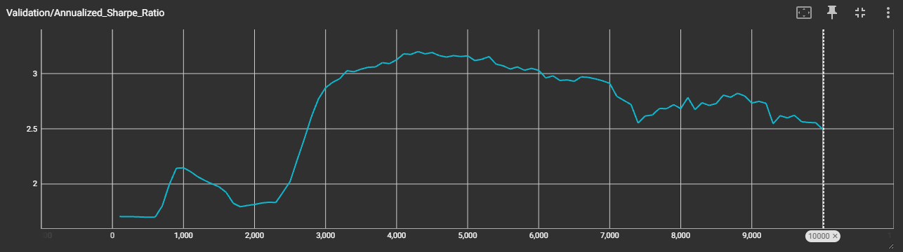
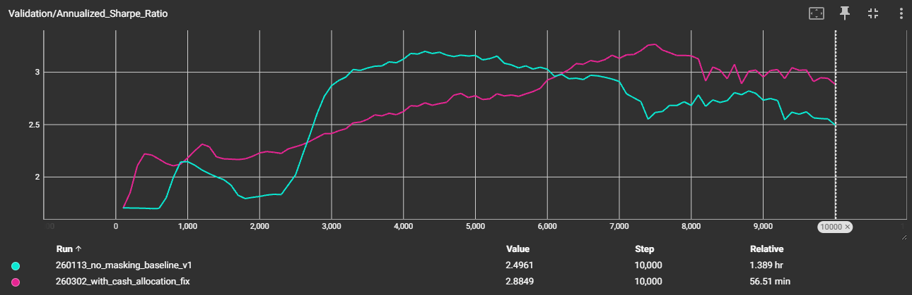

# Deep Reinforcement Learning for Cryptocurrency Portfolio Management

This repository contains a PyTorch implementation of the deep reinforcement learning framework for crypto portfolio management proposed by [Jiang et al. (2017)](https://arxiv.org/abs/1706.10059).

The agent is trained on 3.5 years of historical 30-minute OHLC data for 11 Deribit perpetuals. On the 3-month out-of-sample test set, the agent easily outperforms benchmarks, achieving 59% ROI / 2.15 Sharpe, vs. -39% / -2.11 (uniform buy-and-hold) and 7.3% / 1.28 (best individual asset).

We also identify key behavior patterns, such as high asset concentration, zero cash allocation and high turnover, and suggest and test a number of improvements.

## Key Features & Implementations
- **CNN-based EIIE Policy:** A CNN implementation of the Ensemble of Identical Independent Evaluators (EIIE), in which each asset is judged independently by a CNN-based sub-network with shared parameters. Final asset scores are combined via softmax (with a learnable cash bias) to produce portfolio weights.
- **Transaction Cost Model:** Iterative approximation of the transaction remainder factor $\mu_t$ following the paper's formulation, allowing the agent to take into account the effect of transaction costs.
- **Portfolio-Vector Memory (PVM):** Stores and retrieves previous portfolio weights during training (similar to experience replay memory), significantly speeding up training by allowing parallelization.
- **Online Stochastic Batch Learning (OSBL):** Geometrically-weighted sampling of mini-batches for online adaptation during walk-forward evaluation, allowing the agent to continuously learn from new market data.
- **Walk-Forward Evaluation:** An out-of-sample testing framework that steps through unseen data one period at a time, optionally updating the policy via OSBL.
<!-- - **Asset Availability Masking:** Handles missing data for assets that don't exist throughout the full history by masking them out of the softmax allocation. -->

## Demo
Below you can see the performance of the online-trained agent ("OSBL" / green line) on the 3-month test set, compared to standard benchmarks*. The online-trained agent achieves 59% ROI with a 2.15 Sharpe ratio, outperforming all benchmarks (including the best individual asset, PAXG) despite a broadly declining market.

*\*Benchmarks: UCRP = uniform constant rebalanced portfolio, UBAH = uniform buy-and-hold. Metrics: fAPV = final accumulated portfolio value, SR = annualized Sharpe ratio, MDD = maximum drawdown.*

## Background & Implementation

The project follows the methodology from the [Jiang et al. (2017) paper](https://arxiv.org/abs/1706.10059).

<!-- We highlight some ways in which we deviated from the paper's implementation. -->

## Data

In this project, we use ~4 years of 30-minute OHLC data from 11 Deribit perpetuals. The historical data is downloaded from the Deribit API. This data is split up into 3.5 years of training data, and we reserve 3 months and 3 months for a validation set and a test set. The data spans from April 2022 to January 2026.

These perpetuals are selected based on their 30-day volume. For training, we leave out the linear BTC and ETH perpetuals in favor of their more popular inverse counterparts. The perpetuals we end up using are BTC (inverse), ETH (inverse), SOL, XRP, DOGE, PAXG, ADA, AVAX, DOT, BNB, UNI.

Besides this, we also give the agent access to USDC as the cash asset.

## Key Agent Behavior
Below we show a 1.5-week test set sample of the behavior of the trained agent from the demo. We show the portfolio weights, normalized entropy (portfolio diversification) and turnover.

Analyzing the behavior of the agent as training progresses, reveals a number of key behavior patterns:
1. **Zero cash allocation.** The agent completely abandons the cash asset, never putting any weight on cash under any circumstances.
2. **Exploitation of high volatility.** The agent tends to avoid more stable perpetuals such as BTC or ETH in favor of highly volatile ones, such as UNI and DOGE.
2. **Low portfolio diversification.** The agent tends to go all-in on single assets, instead of maintaining a well-diversified portfolio.
3. **High turnover.** The agent relies on aggressive adjustments to its portfolio, leading to unrealistically high turnover rates.

To understand the mechanics behind these behaviors, we conduct an analysis of the training process of the demo agent in the next section. 

## Diving into a Training Run
As in the paper, the agent is trained to maximize the average log return over a consecutive sequence of 30-minute trading periods. We use the same hyperparameters as the paper, with three adjustments: a commission rate of 0.05% (representing Deribit's taker fees) and a scaled-up batch size (10x) with a proportionally scaled learning rate ($\sqrt{10}$) to increase training speed.

Below we show the average log return on the training set and the annualized Sharpe ratio on the validation set of the agent from the demo. These two plots reveal several distinct phases.

- **Epoch 0 (Initialization).** The agent is initialized with a uniform allocation of its capital across cash (USDC) and all 11 perpetuals. In the generally up-trending validation set, this baseline achieves a 1.7 Sharpe, but doesn't generalize to the down-trending test set (-1.9 Sharpe).

- **Epochs 0-600 (Zero Cash Allocation).** The agent eliminates all cash holdings. Because the training data contains a strong general uptrend (+59% for uniform buy-and-hold), the agent first learns to increase the log returns by maximizing market exposure. We see the average cash weight crash to zero and its capital is divided evenly over all 11 perpetuals. Soon after epoch 600, the CNN's cash bias parameter goes to zero and its gradient vanishes. The network permanently loses its ability to meaningfully update the cash voting score, explaining the zero-cash behavior observed throughout the rest of the training process.

- **Epochs 600-1000 (Exploitation of High Volatility).** With the easy gains out of the way, the agent actually starts picking up on some price dynamics. The training curve steepens significantly and the validation Sharp peaks at 2.1. The agent aggresively lowers its allocation into lower-volatility assets (BTC and ETH average weights drop to 2.8% and 4.0% on the training set), while increasing its allocation into high-volatility ones (such as DOGE and UNI). Intuitively, higher volatility gives higher upside (and downside). Because the reward function maximizes raw log returns without penalizing downside risk, the agent naturally learns to favor high-volatility assets, especially in an up-trend. This behavior clearly generalizes to the validation and test sets. For example, SOL gets an average 11.9% weight on the training set with 114% volatility, dropping to 7.1% average weight with 86% volatility on the test. The notable exception to this rule is PAXG, a gold-backed token. Despite having the lowest volatility by far, PAXG exhibits a slow, sustained up-trend, which is relatively uncorrelated with the broader crypto market. This makes it a useful asset during market down-turns. Indeed, it receives the highest average weight out of all assets, 20.0% and 17.7% on the validation and test set. The agent's strategy generalizes to the test set, achieving a 1.6 test Sharpe (2.1 with OSBL).
<!-- During this window, the agent seems to have learned some general trend-following strategy that translate well to the validation set. The market is generally uptrending on both sets, so this strategy generalizes well. The market is, however, trending down in the test set, which explains the bad generalization to the test set achieving a 1.7 test Sharpe at epoch 1000. Note that OSBL brings this up to the empirical maximum of 2.1, highlighting the usefulness of OSBL in adapting to the non-stationary of price data. -->
- **Epochs 1000-2000 (Overfitting).** The validation Sharpe drops from its first peak of a 2.1 Sharpe at epoch 1000 to a 1.8 at epoch 2000. While the training log returns are now increasing slowly, the networks's parameter's L2 norm and the average portfolio turnover both double. Portfolio diversification collapses as the agent doubles down on isolated, highly concentrated bets. The average weights of lower-volatility assets (BTC and ETH) further drop. The degradation of the validation Sharpe indicates the start of overfitting. Incidentally, the test Sharpe is 2.1 (close to the empirical maximum). Applying OSBL worsens the test Sharpe, down to 1.9.
<!-- OSBL has no effect on the validation set, while actually being detrimental on the test set. The test Sharpe is 2.1 by pure coincidence, since applying OSBL actually decreases the test Sharpe to 1.9. -->
- **Epochs 2000-4000 (Lucky Gains).** The validation Sharpe suddenly increases from 1.8 to 3.2. However, this progress is driven by a doubling of the returns, not by better risk management. The agent continues making highly aggressive, concentrated bets. On top of that, it has now also picked up on subtle micro-patterns in the training data that only coincidentally generalize to the validation set. Unfortunately, this improvement on the validation set does not generalize to the test set: the test Sharpe slips from 2.1 to 2.0. OSBL manages to pull the test Sharpe back up to empirical maximum of 2.2.
- **Epochs 4000+ (More Overfitting).** Both the average log return on the training set, as well as the L2 norm of the model's parameters keep increasing at the same steady pace, while the validation Sharpe steadily degrades. By epoch 10000, the test Sharpe has also dropped to 1.7 and OSBL cannot mitigate this degradation anymore. It is now clear that the agent is severly overtrained.

## Effect of OSBL
The previous section shows that OSBL can act as a powerful mechanism to handle the non-stationarity of financial price data, but *only* if the base network retains sufficient adaptability.

Empirically, we have found that the upper bound of the Sharpe ratio on the (out-of-sample) test set is around 2.2. Remarkably, an untrained agent (epoch 0), which scores -1.9 Sharpe out of the box, manages to score a 2.1 test Sharpe after applying OSBL. Similarly, the epoch-1000 agent increases its test Sharpe from 1.6 to 2.1 after OSBL. An undertrained agent retains its adaptability, so that rolling it forward through the validation set and then the test set using OSBL allows it to cleanly adapt to changing regimes in the historical data.

Conversely, applying OSBL to an overtrained agent yields diminishing or even negative returns. By the time the network overfits, its weights have grown massive, gradients have vanished, and it has lost its ability to effectively adapt to changing regimes.

The takeaway is that, in non-stationary environments like crypto markets, it seems more effective to undertrain the network and use OSBL for online adaptation, rather than relying on an overtrained static network.

## Fixing the Issue of Zero Cash Allocation
The agent gets stuck completely ignoring cash, because the gradient of the cash bias parameter vanishes early in training (see the epochs 0-600 of the deep-dive section) and its value gets overwhelmed by the voting scores of the non-cash assets.
1. **Applying a penalty to negative returns.** This made the training process extremely unstable and hyperparameter-sensitive: set it too low and cash will end up being ignored; set it too high and the agent parks all of its capital in cash.
2. **Asset availability masking.** Following the paper's implementation, we set the normalized price histories of unavailable assets to 1 (identical to cash). We hypothesized that the agent was confusing the two. We tweaked the network architecture so that unavailable assets could be masked out entirely, but final performance barely changed. The possible confusion only exists in the training data where some assets' records aren't available yet, not in the validation/test set.
3. **Removing the cash bias parameter (solution).** Instead of using a separate learnable cash bias, as the paper does, we treat cash as just another asset with a fixed price of 1, processed by the CNN identically to any other non-cash asset. This prevents the gradient-vanishing problem that killed cash allocation in the old architecture.

As a result, the average cash weight stabilizes at ~15% on the training set instead of crashing to zero. This weight is taken from PAXG and BNB, two low-volatility assets that the old agent was using as safe-haven assets in absence of cash. The improved agent peaks at a 3.3 validation Sharpe, though test set performance has significantly degraded because of overtraining. On the other hand, an undertrained epoch-400 agent with the new architecture and OSBL (11.1% average cash weight) matches the demo agent's test performance.

<!-- ## Results & Experiments

### Experiment 1: Batch Size

### Experiment 2: Weight Decay

## Conclusions

A number of points should be highlighted.
- **Zero market impact and zero slippage is unrealistic**. The two assumptions that the paper makes of zero market impact and zero slippage are completely unrealistic for most Deribit perpetuals in this project. For example, the least-traded perpetual, UNI, only has ~300k USD daily volume and the market is very illiquid. The bid-ask spread is 5 times the tick size and there is only 15k USD size within 50 bips from the top-of-book. We see similar patterns for the other less popular perpetuals. The DOT perpetual has bid-ask spread of 500 times the tick size. For live trading, we must limit ourselves to highly liquid markets (such as inverse BTC and ETH perpetuals) and include a model of market impact and slippage.
- The fact that BTC and ETH are relatively absent in the portfolio of the trained agents makes me think that it's picking up on patterns in the altcoins. Since they are usually more volatile, the upside is way higher (and so is the downside).
- How to deal with zero cash allocation? Maybe we should not treat it as a separate cash bias, but as part of the network, similarly to how we treat each other asset. We see that PAXG is used as a safe haven instead of cash.

We should look into the following improvements:
- More realistic modeling of market impact and slippage, in order to punish unrealistic turnover, especially in illiquid altcoins. Alternatively, we could add a penalty term to the reward function that punishes high turnover.
- Adjust the reward function to take into account downside risk. -->

